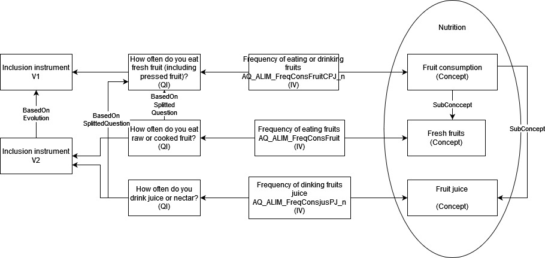

# Constances use case for the DDI representation of variables in repetitive contexts

## General description

In order to meet the requirements of researchers and various institutions using Constances data, a clear and precise description of the different available variables (at enrollment and follow-up) must be accessible. For this first use case, we propose a focus on smoking-related data.

## Sources and variables

Smoking status was thoroughly investigated through a questionnaire, both at enrollment and during the study's follow-up, encompassing a total of 39 variables.
- 34 variables at enrollment (including 31 collected variables and 3 calculated variables).
- 5 variables at follow-up.

| Period     | Years                            | Domain Level 1       | Domain Level 2 | Conceptual Variable         | Variable ID            | Label                                                  | Modality/Unit        | Source                                 | Linked Variable                | Cleaning Procedure                                        | Percentage Missing (%) |
|------------|----------------------------------|-----------------------|-----------------|-----------------------------|------------------------|--------------------------------------------------------|-----------------------|----------------------------------------|--------------------------------|------------------------------------------------------------|-----------------------|
| Inclusion  | Based on year of inclusion: 2012-2020 | Behavioral Factor | Smoking         | Tobacco Consumption Lifetime | AQ_COMPORT_TcTabac   | Have you ever consumed tobacco in your life?         | Yes/No                | Collected Variable: Paper Questionnaires   |  | If yes & no then missing / If 1 Linked Variable not missing then yes  | 1.5                   |
| Inclusion  | Based on year of inclusion: 2012-2020 | Behavioral Factor | Smoking         | Age of Smoking Initiation   | AQ_COMPORT_TcAgeDeb | If yes: At what age did you start?                | Years                 | Collected Variable: Paper Questionnaires    | AQ_COMPORT_TcTabac   | Quantity Cleaning / If a > Age + 1 then missing             | 4.2                   |
| Inclusion  | Based on year of inclusion: 2012-2020 | Behavioral Factor | Smoking         | Current Smoking            | AQ_COMPORT_TcFumAct | If yes: Do you still smoke currently?              | Yes/No                | Collected Variable: Paper Questionnaires    | AQ_COMPORT_TcTabac   | If yes & no then missing                                    | 4.1                   |
| Inclusion  | Based on year of inclusion: 2012-2020 | Behavioral Factor | Smoking         | Age of Smoking Cessation   | AQ_COMPORT_TcAgeFin | If no: (If you no longer smoke) At what age did you quit (last quit)? | Years                 | Collected Variable: Paper Questionnaires    | AQ_COMPORT_TcTabac   | Quantity Cleaning / If a > Age + 1 then missing             | 7.2                   |
| Inclusion  | Based on year of inclusion: 2012-2020 | Behavioral Factor | Smoking         | Duration of Smoking Cessation | AQ_COMPORT_TcArr1an | If you have quit and restarted, how long did these cessation periods last in total? | Less than 1 year/1 year or more | Collected Variable: Paper Questionnaires    | AQ_COMPORT_TcTabac   | If AQ_COMPORT_TcArrNbAn_n < 1 then Less than 1 year / if AQ_COMPORT_TcArrNbAn_n >= 1 then 1 year or more / If both answers then missing | 30.4                  |
| Inclusion  | Based on year of inclusion: 2012-2020 | Behavioral Factor | Smoking         | Duration of Smoking Cessation | AQ_COMPORT_TcArrNbAn | If you have quit and restarted, indicate the total number of years of cessation | Years                 | Collected Variable: Paper Questionnaires    | AQ_COMPORT_TcArr1an | Quantity Cleaning / if a in years & a > date of birth & a < date of answer then date of answer - a / if a > age then missing | 31.9                  |
| Inclusion  | Based on year of inclusion: 2012-2020 | Behavioral Factor | Smoking         | Smoking: Cigarette         | AQ_COMPORT_TcCigt   | Have you smoked cigarettes (excluding e-cigarettes*) during your consumption periods? | Yes/No                | Collected Variable: Paper Questionnaires    | AQ_COMPORT_TcTabac   | If yes & no then missing / if AQ_COMPORT_TcCigt1An_n or AQ_COMPORT_TcCigt1J_n not missing then yes | 2.8                   |
| Inclusion  | Based on year of inclusion: 2012-2020 | Behavioral Factor | Smoking         | Duration of Cigarette Smoking | AQ_COMPORT_TcCigt1An | If yes: How many years have you smoked cigarettes? | Less than 1 year/1 year or more | Collected Variable: Paper Questionnaires    | AQ_COMPORT_TcCigt   | If AQ_COMPORT_TcCigtNbAn_n < 1 then Less than 1 year / if AQ_COMPORT_TcCigtNbAn_n >= 1 then 1 year or more / If both answers then missing | 5.0                   |
| Inclusion  | Based on year of inclusion: 2012-2020 | Behavioral Factor | Smoking         | Duration of Cigarette Smoking | AQ_COMPORT_TcCigtNbAn | If yes: Indicate the number of years you have smoked cigarettes | Years                 | Collected Variable: Paper Questionnaires    | AQ_COMPORT_TcCigt   | Quantity Cleaning / if a in years & a > date of birth & a < date of answer then date of answer - a / if a > age then missing | 8.4                   |
| Inclusion  | Based on year of inclusion: 2012-2020 | Behavioral Factor | Smoking         | Quantity of Cigarettes     | AQ_COMPORT_TcCigt1J | If yes: How many cigarettes per day on average? | Less than 1 cigarette per day/1 cigarette or more | Collected Variable: Paper Questionnaires    | AQ_COMPORT_TcCigt   | If AQ_COMPORT_TcCigtJNb_n < 1 then Less than 1 year / if AQ_COMPORT_TcCigtJNbn_n >= 1 then 1 year or more / If both answers then missing | 4.1                   |
| Inclusion  | Based on year of inclusion: 2012-2020 | Behavioral Factor | Smoking         | Quantity of Cigarettes     | AQ_COMPORT_TcCigtJNb | If yes: Indicate how many cigarettes per day on average? | Cigarettes per day    | Collected Variable: Paper Questionnaires    | AQ_COMPORT_TcCigt   | Quantity Cleaning / if a > 96 then missing / if a not a number then missing | 5.3                   |
| Inclusion  | Based on year of inclusion: 2012-2020 | Behavioral Factor | Smoking         | Smoking: Cigarillo         | AQ_COMPORT_TcCigl   | Have you smoked cigarillos during your consumption periods? | Yes/No                | Collected Variable: Paper Questionnaires    | AQ_COMPORT_TcTabac   | If yes & no then missing / if AQ_COMPORT_TcCigl1An_n or AQ_COMPORT_TcCigl1J_n not missing then yes | 40.2                  |
| Inclusion  | Based on year of inclusion: 2012-2020 | Behavioral Factor | Smoking         | Duration of Cigarillo Smoking | AQ_COMPORT_TcCigl1An | If yes: How many years have you smoked cigarillos? | Less than 1 year/1 year or more | Collected Variable: Paper Questionnaires    | AQ_COMPORT_TcCigl   | If AQ_COMPORT_TcCiglNbAn_n < 1 then Less than 1 year / if AQ_COMPORT_TcCiglNbAn_n >= 1 then 1 year or more / If both answers then missing | 40.2                  |
| Inclusion  | Based on year of inclusion: 2012-2020 | Behavioral Factor | Smoking         | Duration of Cigarillo Smoking | AQ_COMPORT_TcCiglNbAn | If yes: Indicate the number of years you have smoked cigarillos | Years                 | Collected Variable: Paper Questionnaires    | AQ_COMPORT_TcCigl   | Quantity Cleaning / if a in years & a > date of birth & a < date of answer then date of answer - a / if a > age then missing | 40.4                  |
| Inclusion  | Based on year of inclusion: 2012-2020 | Behavioral Factor | Smoking         | Quantity of Cigarillos     | AQ_COMPORT_TcCigl1J | If yes: How many cigarillos per day on average? | Less than 1 cigarillo per day/1 cigarillo or more | Collected Variable: Paper Questionnaires    | AQ_COMPORT_TcCigl   | If AQ_COMPORT_TcCiglJNb_n < 1 then Less than 1 year / if AQ_COMPORT_TcCiglJNbn_n >= 1 then 1 year or more / If both answers then missing | 40.3                  |
| Inclusion  | Based on year of inclusion: 2012-2020 | Behavioral Factor | Smoking         | Quantity of Cigarillos     | AQ_COMPORT_TcCiglJNb | If yes: Indicate how many cigarillos per day on average? | Cigarillos per day    | Collected Variable: Paper Questionnaires    | AQ_COMPORT_TcCigl   | Quantity Cleaning / if a > 96 then missing / if a not a number then missing | 40.3                  |
| Inclusion  | Based on year of inclusion: 2012-2020 | Behavioral Factor | Smoking         | Smoking: Pipe              | AQ_COMPORT_TcPipe   | Have you smoked a pipe during your consumption periods? | Yes/No                | Collected Variable: Paper Questionnaires    | AQ_COMPORT_TcTabac   | If yes & no then missing / if AQ_COMPORT_TcPipe1An_n or AQ_COMPORT_TcPipe1J_n not missing then yes | 40.3                  |
| Inclusion  | Based on year of inclusion: 2012-2020 | Behavioral Factor | Smoking         | Duration of Pipe Smoking   | AQ_COMPORT_TcPipe1AN | If yes: How many years have you smoked a pipe?    | Less than 1 year/1 year or more | Collected Variable: Paper Questionnaires    | AQ_COMPORT_TcPipe   | If AQ_COMPORT_TcPipeNbAn_n < 1 then Less than 1 year / if AQ_COMPORT_TcPipeNbAn_n >= 1 then 1 year or more / If both answers then missing | 40.4                  |
| Inclusion  | Based on year of inclusion: 2012-2020 | Behavioral Factor | Smoking         | Duration of Pipe Smoking   | AQ_COMPORT_TcPipeNbAn | If yes: Indicate the number of years you have smoked a pipe | Years                 | Collected Variable: Paper Questionnaires    | AQ_COMPORT_TcPipe   | Quantity Cleaning / if a in years & a > date of birth & a < date of answer then date of answer - a / if a > age then missing | 40.4                  |
| Inclusion  | Based on year of inclusion: 2012-2020 | Behavioral Factor | Smoking         | Quantity of Pipes          | AQ_COMPORT_TcPipe1J | If yes: How many pipes per day on average?         | Less than 1 pipe per day/1 pipe or more | Collected Variable: Paper Questionnaires    | AQ_COMPORT_TcPipe   | If AQ_COMPORT_TcPipeJNb_n < 1 then Less than 1 year / if AQ_COMPORT_TcPipeJNbn_n >= 1 then 1 year or more / If both answers then missing | 40.4                  |
| Inclusion  | Based on year of inclusion: 2012-2020 | Behavioral Factor | Smoking         | Quantity of Pipes          | AQ_COMPORT_TcPipeJNb | If yes: Indicate how many pipes per day on average? | Pipes per day          | Collected Variable: Paper Questionnaires    | AQ_COMPORT_TcPipe   | Quantity Cleaning / if a > 96 then missing / if a not a number then missing | 40.5                  |
| Inclusion  | Based on year of inclusion: 2012-2020 | Behavioral Factor | Smoking         | Smoking: Cigar             | AQ_COMPORT_TcCigr   | Have you smoked cigars during your consumption periods? | Yes/No                | Collected Variable: Paper Questionnaires    | AQ_COMPORT_TcTabac   | If yes & no then missing / if AQ_COMPORT_TcCigr1An_n or AQ_COMPORT_TcCigr1J_n not missing then yes | 40.5                  |
| Inclusion  | Based on year of inclusion: 2012-2020 | Behavioral Factor | Smoking         | Duration of Cigar Smoking  | AQ_COMPORT_TcCigr1An | If yes: How many years have you smoked cigars?     | Less than 1 year/1 year or more | Collected Variable: Paper Questionnaires    | AQ_COMPORT_TcCigr   | If AQ_COMPORT_TcCigrNbAn_n < 1 then Less than 1 year / if AQ_COMPORT_TcCigrNbAn_n >= 1 then 1 year or more / If both answers then missing | 40.6                  |
| Inclusion  | Based on year of inclusion: 2012-2020 | Behavioral Factor | Smoking         | Duration of Cigar Smoking  | AQ_COMPORT_TcCigrNbAn | If yes: Indicate the number of years you have smoked cigars | Years                 | Collected Variable: Paper Questionnaires    | AQ_COMPORT_TcCigr   | Quantity Cleaning / if a in years & a > date of birth & a < date of answer then date of answer - a / if a > age then missing | 40.6                  |
| Inclusion  | Based on year of inclusion: 2012-2020 | Behavioral Factor | Smoking         | Quantity of Cigars         | AQ_COMPORT_TcCigr1J | If yes: How many cigars per day on average?        | Less than 1 cigar per day/1 cigar or more | Collected Variable: Paper Questionnaires    | AQ_COMPORT_TcCigr   | If AQ_COMPORT_TcCigrJNb_n < 1 then Less than 1 year / if AQ_COMPORT_TcCigrJNbn_n >= 1 then 1 year or more / If both answers then missing | 40.6                  |
| Inclusion  | Based on year of inclusion: 2012-2020 | Behavioral Factor | Smoking         | Quantity of Cigars         | AQ_COMPORT_TcCigrJNb | If yes: Indicate how many cigars per day on average? | Cigars per day         | Collected Variable: Paper Questionnaires    | AQ_COMPORT_TcCigr   | Quantity Cleaning / if a > 96 then missing / if a not a number then missing | 40.6                  |
| Inclusion  | Based on year of inclusion: 2012-2020 | Behavioral Factor | Smoking         | Smoking: Cigarillo, Cigar, Pipe | AQ_COMPORT_TcPCCP   | Have you smoked cigarillos, cigars, or pipes during your consumption periods? | Yes/No                | Collected Variable: Paper Questionnaires    | AQ_COMPORT_TcTabac   | If yes & no then missing / if AQ_COMPORT_TcCCP1An_n or AQ_COMPORT_TcCCP1J_n not missing then yes | 19.3                  |
| Inclusion  | Based on year of inclusion: 2012-2020 | Behavioral Factor | Smoking         | Duration of Cigarillo, Cigar, Pipe | AQ_COMPORT_TcCCP1An | If yes: How many years have you smoked cigarillos, cigars, or pipes? | Less than 1 year/1 year or more | Collected Variable: Paper Questionnaires    | AQ_COMPORT_TcPCCP   | If AQ_COMPORT_TcCCPNbAn_n < 1 then Less than 1 year / if AQ_COMPORT_TcCCPNbAn_n >= 1 then 1 year or more / If both answers then missing | 19.5                  |
| Inclusion  | Based on year of inclusion: 2012-2020 | Behavioral Factor | Smoking         | Duration of Cigarillo, Cigar, Pipe | AQ_COMPORT_TcCCPNbAn | If yes: Indicate the number of years you have smoked cigarillos, cigars, or pipes | Years                 | Collected Variable: Paper Questionnaires    | AQ_COMPORT_TcPCCP   | Quantity Cleaning / if a in years & a > date of birth & a < date of answer then date of answer - a / if a > age then missing | 19.8                  |
| Inclusion  | Based on year of inclusion: 2012-2020 | Behavioral Factor | Smoking         | Quantity of Cigarillo, Cigar, Pipe | AQ_COMPORT_TcCCP1J | If yes: How many per day on average?               | Less than 1 per day/1 or more per day | Collected Variable: Paper Questionnaires    | AQ_COMPORT_TcPCCP   | If AQ_COMPORT_TcCCPJNb_n < 1 then Less than 1 year / if AQ_COMPORT_TcCCPJNbn_n >= 1 then 1 year or more / If both answers then missing | 19.6                  |
| Inclusion  | Based on year of inclusion: 2012-2020 | Behavioral Factor | Smoking         | Quantity of Cigarillo, Cigar, Pipe | AQ_COMPORT_TcCCPJNb | If yes: Indicate how many per day on average?      | Per day               | Collected Variable: Paper Questionnaires    | AQ_COMPORT_TcPCCP   | Quantity Cleaning / if a > 96 then missing / if a not a number then missing | 19.7                  |
| Inclusion  | Based on year of inclusion: 2012-2020 | Behavioral Factor | Smoking         | Tobacco Consumption for Life | AQ_COMPORT_TcStatutGlobal_i | Lifetime global smoking status | Non-smokers; Smokers/Ex-smokers; Missing Value | Calculated Variable |   || 1.5                   |
| Inclusion  | Based on year of inclusion: 2012-2020 | Behavioral Factor | Smoking         | Smoking: Pack-years        | AQ_COMPORT_TcStatut_i | Smoking status defined at inclusion | Non-smokers; Smokers; Ex-smokers; Missing Value | Calculated Variable |   || 4.1                   |
| Inclusion  | Based on year of inclusion: 2012-2020 | Behavioral Factor | Smoking         | Current Smoking Status     | AQ_COMPORT_TcPA_i    | Smoking status: pack-years | Pack-years            | Calculated Variable |   || 9.8                   |
| Follow-up  | Once a year since 2013               | Behavioral Factor | Smoking         | Current Smoking Status     | AQ_COMPORT_TcActFume | Currently, do you smoke (excluding e-cigarettes)? | [Yes (at least once a day); No or occasionally] | Collected Variable: Paper and Web Questionnaires || If yes & no then missing / if 1 Variable linked not missing then yes | 2.4                   |
| Follow-up  | Once a year since 2013               | Behavioral Factor | Smoking         | Quantity of Cigarettes     | AQ_COMPORT_TcCigtJNb | If yes, how many do you smoke per day on average (cigarettes)? | Cigarettes per day    | Collected Variable: Paper and Web Questionnaires | AQ_COMPORT_TcActFume | Quantity Cleaning / if a > 96 then missing / if a not a number then missing | 3.0                   |
| Follow-up  | Once a year since 2013               | Behavioral Factor | Smoking         | Quantity of Cigarillos     | AQ_COMPORT_TcCiglJNb | If yes, how many do you smoke per day on average (cigarillos)? | Cigarillos per day    | Collected Variable: Paper and Web Questionnaires | AQ_COMPORT_TcActFume | Quantity Cleaning / if a > 96 then missing / if a not a number then missing | 12.4                  |
| Follow-up  | Once a year since 2013               | Behavioral Factor | Smoking         | Quantity of Pipes          | AQ_COMPORT_TcPipeJNb | If yes, how many do you smoke per day on average (pipes)? | Pipes per day          | Collected Variable: Paper and Web Questionnaires | AQ_COMPORT_TcActFume | Quantity Cleaning / if a > 96 then missing / if a not a number then missing | 12.7                  |
| Follow-up  | Once a year since 2013               | Behavioral Factor | Smoking         | Duration of Cigars         | AQ_COMPORT_TcCigrJNb | If yes, how many do you smoke per day on average (cigars)? | Cigars per day         | Collected Variable: Paper and Web Questionnaires | AQ_COMPORT_TcActFume | Quantity Cleaning / if a > 96 then missing / if a not a number then missing | 12.7                  |

## What do we want to represent?

To better organize this data and facilitate decision-making, it is recommended to these variables in a standard DDI format. The detail of the variables available in the specific Excel table 
All described parts listed in the tables and also 
- Highlight comparable questions between inclusion and follow up
- Highlight participation (respondent) at each follow up
- Highlight the number on follow up wave for participants (median follow-up…) 

## Selected use cases

### Fruits

Instrument: Inclusion V1 
- Concept: Fruit consumption
  - Question: How often do you eat raw or cooked fruit (including 100% fruit juice)? / A quelle fréquence consommez-vous des fruits crus ou cuits (y compris les jus 100% fruit) ?
    - InstanceVariable: AQ_ALIM_FreqConsFruit

Instrument: Inclusion V2
- Concept: Fresh fruit consumption / Consommation de fruits frais?
- (BasedOn Previous question) How often do you eat fresh fruit (including pressed fruit)? / A quelle fréquence mangez-vous des fruits frais (y compris fruits pressés)?
  - Instance variable: AQ_ALIM_FreqConsFruitCPJ_n

- Concept: Fruit juice consumption / Consommation de jus de fruit?
- (BasedOn Previous question) How often do you drink juice or nectar?
  - Instance variable: AQ_ALIM_FreqConsjusPJ_n

### Cigarettes
Instrument: Inclusion
- Question: If yes: Do you still smoke currently? 
  - Instance variable: AQ_COMPORT_TcFumAct
- If yes: Indicate how many cigarettes per day on average?
  - Instance variable: AQ_COMPORT_TcCigtJNb

Instrument: Follow-up Instrument
- Question: Currently, do you smoke (excluding e-cigarettes)? --> AQ_COMPORT_TcActFume
- Question: If yes, how many do you smoke per day on average (cigarettes)?
  - Instance variable: AQ_COMPORT_TcCigtJNb