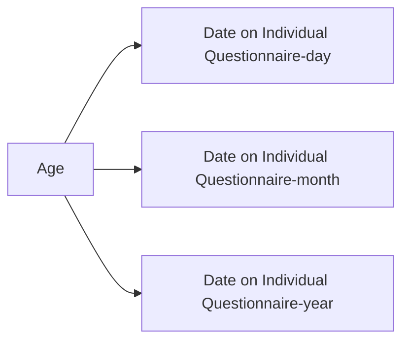
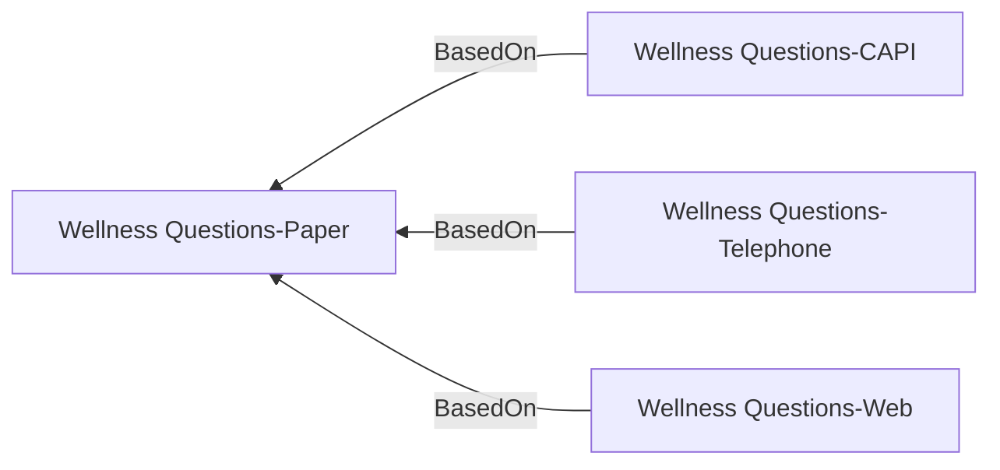
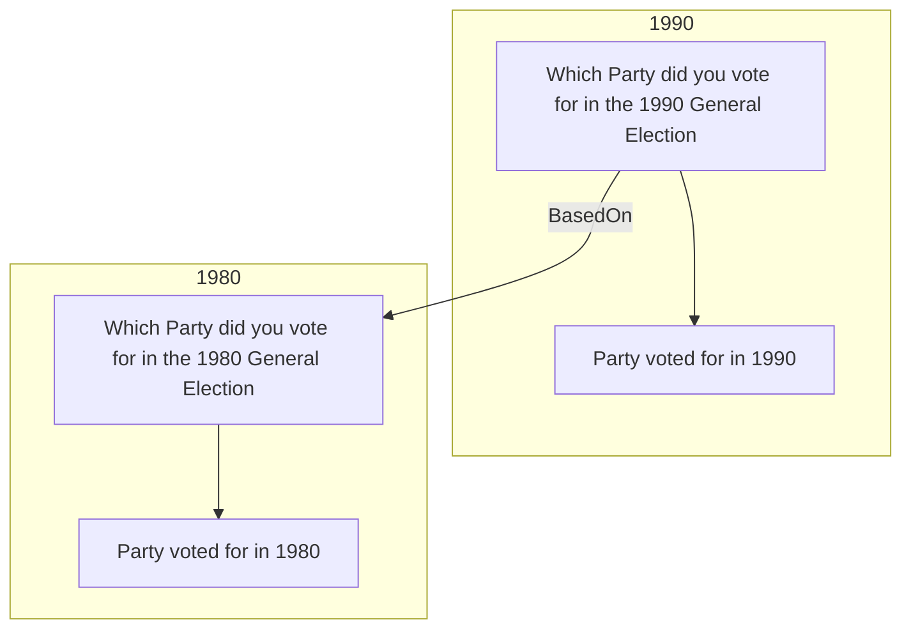
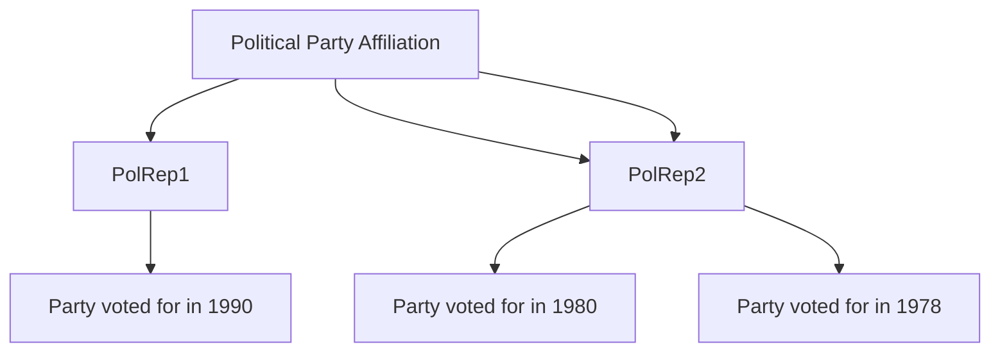
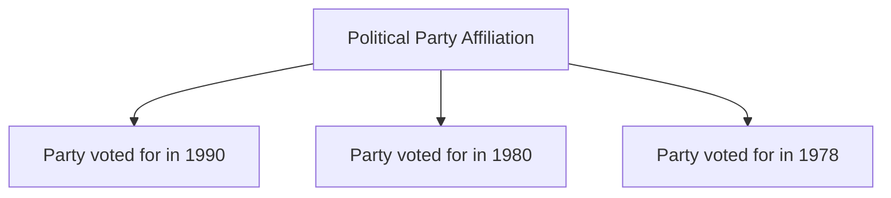
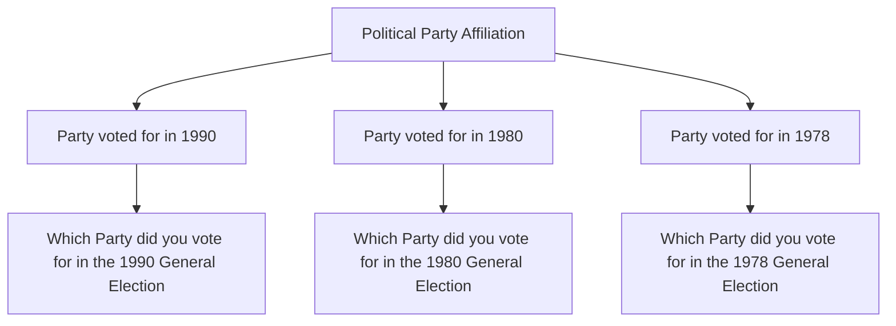
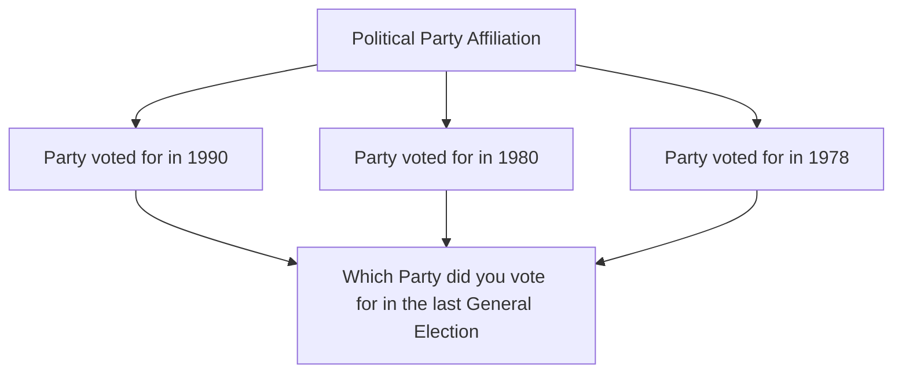

# Overview of DDI ways of comparing items

## Grouping

### Variable and Question Groups
Use of These specialised structures allow a list of references to items which can be grouped normally to a controlled vocabulary
Variable Groups example: https://discovery.closer.ac.uk/Item/uk.closer/766a9222-4c66-4f84-9259-b78ceda9ceab/1

### BasedOn
This allows an item to reference another item using the source URN and also supports both a textual description and use of  a controlled vocabulary.

#### Single source

#### Lifecycle evolution of a question and variable

#### Lifecycle evolution of a variable

### Variable Cascade
This is a hierachy of
- A conceptual variable
- Represented variables
- Instance variable

The variable cascade does not require all three to be specified.
- A conceptual variable
- Instance variables

If question information is available these relationships can also be expresed

If same question ithese relationships can also be expresed

